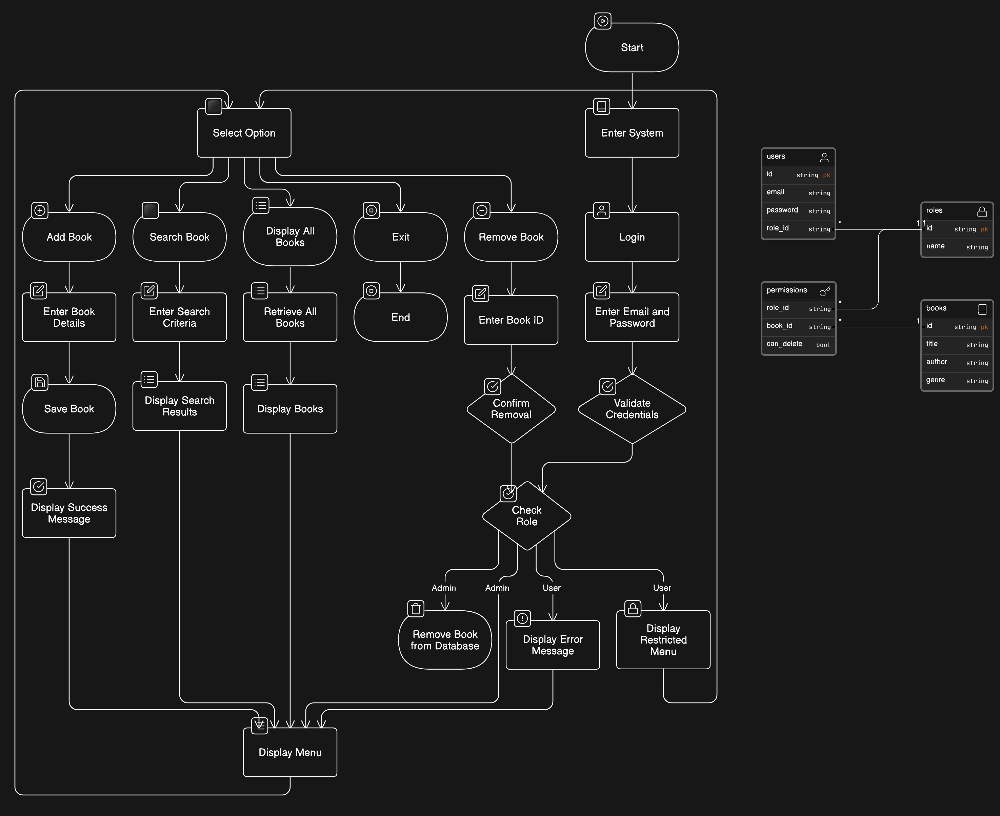

# Book Management System

This is a book management system built with PHP and JavaScript, using the Laravel framework.

## Features

- User authentication
- Role-based access control
- CRUD operations for books

## Requirements

- PHP 8
- Composer
- Node.js
- NPM

## Diagrams and Screenshots

## Installation

1. Clone the repository: `git clone https://github.com/achmadfha/books-app.git your-project-directory`
2. Navigate to the project directory: `cd your-project-directory`
3. Install PHP dependencies: `composer install`
4. Install JavaScript dependencies: `npm install`
5. Copy the example env file: `cp .env.example .env`
6. Generate an app key: `php artisan key:generate`
7. Run the migrations: `php artisan migrate`
8. Seed the database: `php artisan db:seed`
9. Start the server: `php artisan serve`

## User Roles

- GA: Global Admin (GA can do everything)
- Admin: Admin (Admin can do everything except delete books)
- User: User (User can only view books details)
- Guest: Guest (Guest can only preview books)

## Credentials

- GA: email: `ga@example.com`, password: `StrongPassword123!`
- Admin: email: `admin@example.com`, password: `StrongPassword123!`
- User: email: `User@example.com`, password: `StrongPassword123!`

## Usage

Visit `http://localhost:8000` in your browser to start using the application .
